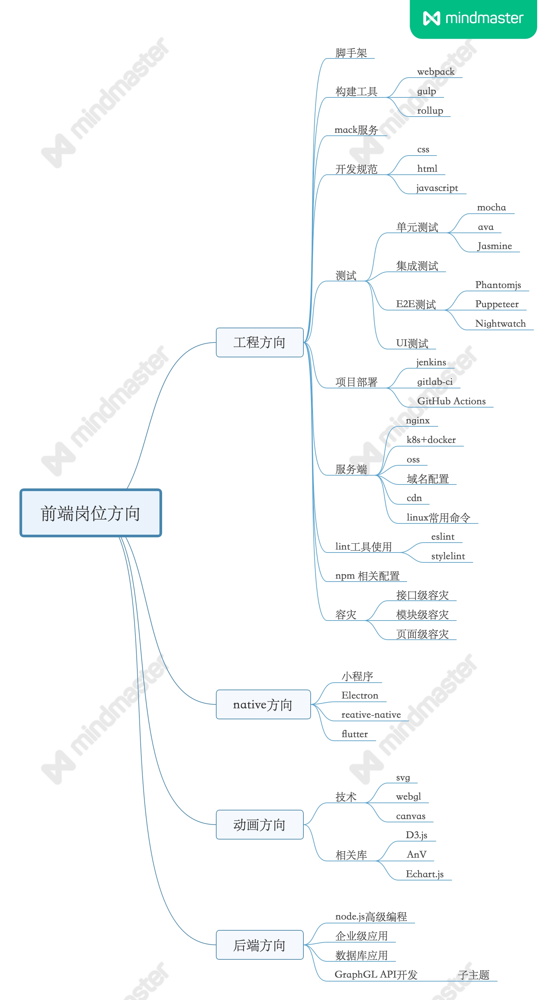
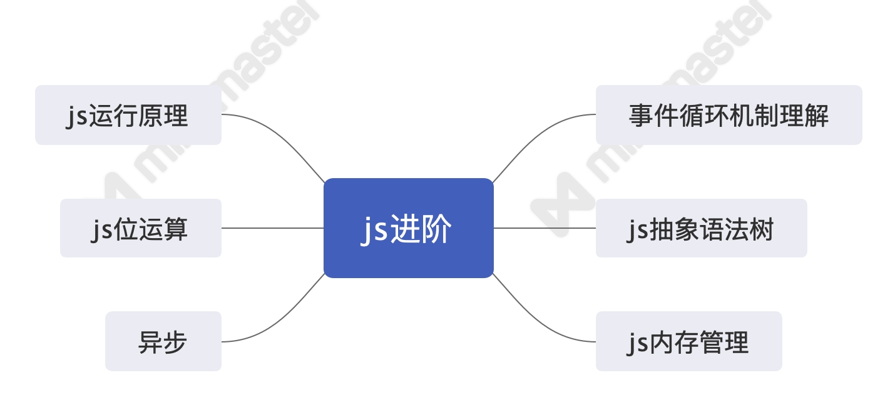

 

## 前言

本人平时学习及收集内容，欢迎参入一起讨论。

## 关于作者

暂时欠着

## 前端面试内容导图

前端涉及的东西相对比较，对知识点做以下分类，仅个人观点。

### 一、前端求职方向

1. native 方向(reative-native、小程序、Electron 等)
2. 后端方向(nodejs 的使用、mysql、redis、rabittMQ)
3. 动画方向(webgl、svg、canvas)
4. 工程化方向(组件化、打包使用如 webpack、监控数据上报、制定规范、单元测试搭建、发布工具(jenkins、gitlab-ci)、线上环境及开发环境搭建、灰度发布、docker 使用、nginx 配置、cdn 配置、缓存设置、前端性能优化)
5. 专业写业务

### javascript 基础

### javascript 进阶

### nodejs 学习

### CSS 基础

参考资料

1. [常见 CSS 布局](https://github.com/ftTony/blog/issues/3)
1. [几种常见的 CSS 布局](https://github.com/ljianshu/Blog/issues/40)
1. [如何居中一个元素（终结版）](https://mp.weixin.qq.com/s/UxY7VWqMMOjvgE6L_dlixA)

### 框架

### 浏览器

### 算法

相关连接：

[源码](https://github.com/ftTony/notes/tree/master/javascript/algorithm)

### 网络

### 其它

### 前端主管具备能力

[常见手写代码部分](https://github.com/ftTony/notes/tree/master/%20InterviewQuestion)

## 联系作者

    

        平凡世界，贵在坚持。
    

    

